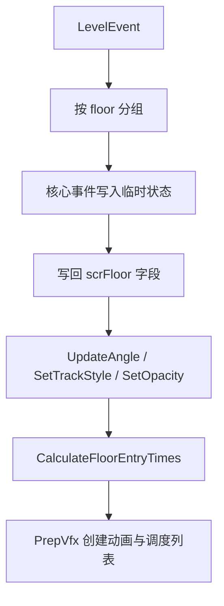

# 轨道与地板事件

本页覆盖阶段 5 的轨道与地板事件族。它们分成两类：一类在 `scnGame.ApplyEventsToFloors()` 中直接写入 `scrFloor` 状态；另一类由 `scnGame.ApplyEvent()` 创建 `ffxPlusBase` 子类，在运行时按时间触发 tween 或 checkpoint 行为。

## 源码范围

| 类型或方法 | 源码路径 | 角色 |
| --- | --- | --- |
| `scnGame.ApplyEventsToFloors` | `7thRhythmSource/ADOFAi/scnGame.cs` | 应用核心地板事件、计算地板状态、创建效果组件。 |
| `scnGame.ApplyEvent` | `7thRhythmSource/ADOFAi/scnGame.cs` | 把 `MoveTrack`、`RecolorTrack`、`Checkpoint` 等事件映射到效果组件。 |
| `ffxMoveFloorPlus` | `7thRhythmSource/ADOFAi/ffxMoveFloorPlus.cs` | 运行时移动、旋转、缩放和淡化地板。 |
| `ffxRecolorFloorPlus` | `7thRhythmSource/ADOFAi/ffxRecolorFloorPlus.cs` | 运行时重设轨道颜色、样式、脉冲和 glow。 |
| `ffxChangeTrack` | `7thRhythmSource/ADOFAi/ffxChangeTrack.cs` | 为地板准备颜色、贴图和出现/消失动画。 |
| `ffxFloorAppearPlus` | `7thRhythmSource/ADOFAi/ffxFloorAppearPlus.cs` | 地板出现动画组件。 |
| `ffxFloorDisappearPlus` | `7thRhythmSource/ADOFAi/ffxFloorDisappearPlus.cs` | 地板消失动画组件。 |
| `ffxCheckpoint` | `7thRhythmSource/ADOFAi/ffxCheckpoint.cs` | checkpoint 命中效果，负责复活玩家、刷新 checkpoint 进度和图标。 |

## 事件族总览

| 事件 | 处理路径 | 主要写入 |
| --- | --- | --- |
| `SetSpeed` | 核心地板状态 | 影响 `floor.speed`，并参与地板图标选择和 entry time 计算。 |
| `Twirl` | 核心地板状态 | 切换旋转方向标记，设置 `floor.isSwirl`。 |
| `Checkpoint` | `ffxCheckpoint` | 添加 checkpoint 组件；命中时更新 `GCS.checkpointNum` 和 mistakes manager。 |
| `ColorTrack` | 核心地板状态 | 更新当前轨道颜色、颜色类型、脉冲、贴图、样式、outline 和 glow。 |
| `AnimateTrack` | `ffxChangeTrack.PrepFloor` | 为地板创建 `ffxFloorAppearPlus` 和 `ffxFloorDisappearPlus`。 |
| `RecolorTrack` | `ffxRecolorFloorPlus` | 按范围 tween 地板颜色、样式和 glow。 |
| `MoveTrack` | `ffxMoveFloorPlus` | 按范围 tween 地板位置、旋转、缩放和透明度。 |
| `PositionTrack` | 核心地板状态 | 写入地板位置偏移、缩放、透明度、旋转和 `stickToFloors`。 |
| `Hold` | 核心地板状态 | 写入 `holdLength`、`holdDistance`、`showHoldTiming` 并生成 hold 渲染。 |
| `MultiPlanet` | 核心地板状态 | 写入 `numPlanets`，最多限制到 3。 |
| `FreeRoam` / `FreeRoamTwirl` / `FreeRoamRemove` / `FreeRoamWarning` | 核心地板状态与 free roam 网格 | 创建 free roam 区域、标记 swirl、移除格子或设置 warning。 |
| `Pause` | 核心地板状态 | 增加 `extraBeats`、设置 `countdownTicks` 和角度校正。 |
| `AutoPlayTiles` | 核心地板状态 | 写入 `floor.auto`、`showStatusText` 和安全地板状态。 |
| `Hide` | 核心地板状态 | 写入 `hideJudgment` 和 `hideIcon`。 |
| `ScaleMargin` | 核心地板状态 | 写入 `marginScale`。 |
| `ScaleRadius` | 核心地板状态 | 写入 `radiusScale`。 |
| `Multitap` | 核心地板状态 | 写入 `tapsNeeded`，重置 `tapsSoFar`。 |
| `TileDimensions` | 核心地板状态 | 写入 `lengthMult` 和 `widthMult`。 |
| `SetFloorIcon` | 图标流程 | 标记自定义地板图标，影响 `scrFloor.UpdateIconSprite()`。 |

## 核心地板状态流

`ApplyEventsToFloors()` 会先清理地板上的旧 `ffxPlusBase` 组件和 `plusEffects`，随后应用核心地板事件并重算 entry time。核心事件的结果会被写进 `scrFloor`，因此它们不一定拥有独立的 `ffxPlusBase` 组件。

## 颜色与轨道样式

`ColorTrack` 和 `ChangeTrack` 都会读取轨道颜色、次要颜色、颜色动画持续时间、颜色类型、脉冲类型、脉冲长度和样式。`ColorTrack` 还会尝试读取 `trackTexture`，并通过 `scnGame.instance.imgHolder.AddTexture()` 载入贴图。

| 字段 | 写入位置 |
| --- | --- |
| `trackColor` | `tempColor1` 或 `color1`。 |
| `secondaryTrackColor` | `tempColor2` 或 `color2`。 |
| `trackColorAnimDuration` | 颜色动画持续时间。 |
| `trackColorType` | `TrackColorType`。 |
| `trackColorPulse` | `TrackColorPulse`。 |
| `trackPulseLength` | 脉冲长度。 |
| `trackTexture` | 自定义轨道贴图，存在时设置 `TextureWrapMode.Repeat`。 |
| `trackTextureScale` | 贴图缩放。 |
| `trackStyle` | `TrackStyle`，最后写入 `floor.styleNum` 并调用 `SetTrackStyle`。 |
| `trackGlowIntensity` | 除以 100 后写入 `glowMult` 或 `tempGlowMult`。 |

`ffxChangeTrack.PrepFloor()` 会调用 `floor.ColorFloor()`，根据 `ADOBase.controller.usingInitialTrackStyles` 决定是否恢复 `floor.initialTrackStyle`，并设置 `floor.customTexture`。

## 地板移动 `MoveTrack`

`MoveTrack` 由 `ApplyEvent()` 创建 `ffxMoveFloorPlus`。

### Decode

| 事件属性 | 写入字段 |
| --- | --- |
| `duration` | 乘 `crotchet` 后写入 `duration`。 |
| `startTile` / `endTile` | 通过 `scnGame.IDFromTile()` 转换为地板序号 `start` / `end`。 |
| `gapLength` | 写入 `gapLength`。 |
| `positionOffset` | 乘 `ADOBase.controller.tileSize` 后写入 `targetPos`。 |
| `rotationOffset` | 写入 `targetRot`。 |
| `scale` | 除以 100 后写入 `targetScaleV2`。 |
| `opacity` | 除以 100 后写入 `targetOpacity`。 |
| `maxVfxOnly` | 写入 `disableIfMinFx`。 |
| `ease` | 写入 `ease`。 |

每个可选属性还有对应 `positionUsed`、`rotationUsed`、`scaleUsed`、`opacityUsed`，来自 `evnt.disabled[...]`。

### StartEffect

`StartEffect()` 会在 `end < start` 时交换两端，然后按 `1 + gapLength` 遍历目标地板。每个地板的 tween 写入 `scrFloor.moveTweens`：

| Tween 类型 | 行为 |
| --- | --- |
| `PositionX` / `PositionY` | 从当前位置 tween 到 `target.startPos + targetPos` 的 X/Y。 |
| `Rotation` | tween `target.tweenRot.z`，并在 OnUpdate 写回 `targetTransform.eulerAngles`。 |
| `ScaleX` / `ScaleY` | 使用 `DOScale` 分轴设置地板缩放。 |
| `Opacity` | 调用 `target.TweenOpacity(targetOpacity, duration, ease)`。 |

如果目标地板有 `freeroamArea`，其中 `isLandable` 的 free roam 子地板也会被同样处理。

## 地板改色 `RecolorTrack`

`RecolorTrack` 由 `ApplyEvent()` 创建 `ffxRecolorFloorPlus`。它的 `Decode()` 读取 `duration`、`ease`、地板范围、`gapLength`、颜色、颜色类型、脉冲、样式和 glow。

`StartEffect()` 对范围内地板执行：

| 步骤 | 行为 |
| --- | --- |
| 范围修正 | 如果 `end < start`，交换两端。 |
| 样式 | 设置 `target.styleNum`，调用 `UpdateAngle(false)` 和 `SetTrackStyle(style)`。 |
| 清理旧 tween | kill `TweenType.Color` 和 `TweenType.Glow`。 |
| 颜色 | 调用 `target.ColorFloor(colorType, color1, color2, colorAnimDuration / cond.song.pitch, pulseType, pulseLength, start, duration, ease)`。 |
| Glow | tween `target.glowMultiplier` 到 `glowMult`，写入 `target.moveTweens[TweenType.Glow]`。 |

## 轨道出现与消失动画

`AnimateTrack` 本身不由 `ApplyEvent()` 创建组件，而是在 `ffxChangeTrack.PrepFloor()` 中根据轨道动画配置创建组件。

| 动画 | 组件 | 起始时间 |
| --- | --- | --- |
| 出现动画 | `ffxFloorAppearPlus` | 根据当前地板 `entryTime`、BPM、地板速度和 `tilesAhead` 计算。 |
| 消失动画 | `ffxFloorDisappearPlus` | 根据下一地板 `entryTime`、BPM、地板速度和 `tilesBehind` 计算。 |

`ffxFloorAppearPlus` 支持 `Extend`、`Assemble`、`Assemble_Far`、`Grow`、`Grow_Spin`、`Fade`、`Drop`、`Rise`。`FloorSetup()` 会先把地板放到动画初始状态，例如缩放到 0、偏移位置、旋转或透明到 0。

`ffxFloorDisappearPlus` 支持 `Retract`、`Scatter`、`Scatter_Far`、`Shrink`、`Shrink_Spin`、`Fade`。如果地板没有下一地板，它会把 `triggered` 设为 true，不参与消失动画。

## Checkpoint

`Checkpoint` 会在核心地板流程中给地板添加 `ffxCheckpoint`，`ApplyEvent()` 再通过 `gameObject.GetComponent<ffxCheckpoint>()` 取得这个组件。

| 方法 | 行为 |
| --- | --- |
| `Awake()` | 如果当前 floor icon 是 `None` 或 `Vfx`，并且不是 speed trial、练习模式、纯 Perfect 限制，则设置 `FloorIcon.Checkpoint`。 |
| `Decode(LevelEvent evnt)` | 读取 `tileOffset`，并把偏移限制在关卡地板范围内；设置 `ease = Ease.InCirc`。 |
| `StartEffect(scrPlanet planet)` | speed trial、练习模式、纯 Perfect 限制下直接返回；否则更新 checkpoint，复活死亡玩家，播放复活音效，闪白屏，调用 `mistakesManager.MarkCheckpoint(checkpointTileOffset)` 并刷新图标。 |

## 图标流程

`ApplyEventsToFloors()` 会根据地板附近事件决定 `floorIcon`：

| 事件 | 图标行为 |
| --- | --- |
| `Checkpoint` | 优先设置 `FloorIcon.Checkpoint`。 |
| `SetSpeed` | 根据与上一地板速度的差值选择兔、双兔、蜗牛、双蜗牛或同速图标。 |
| `Twirl` | 设置 `FloorIcon.Swirl`。 |
| `Hold` | 根据 hold 长度选择长或短 hold 箭头；后续释放地板显示 release 图标。 |
| `MultiPlanet` | 根据星体数量变化选择二星体、三星体增加或三星体减少图标。 |
| 普通 VFX | 没有更高优先级图标时设置 `FloorIcon.Vfx`，并记录 `floor.eventIcon`。 |

## Free Roam

`FreeRoam` 事件在核心地板流程中创建区域：如果地板存在下一地板且 `duration >= 2`，写入 `freeroamRegion`、`freeroam`、`freeroamDimensions`、`freeroamOffset`、`freeroamEndEarlyBeats`、`freeroamEndEase`、`countdownTicks`、角度校正与 hitsound 节拍设置，并调用 `lm.MakeFreeroamGrid(floor5)`。

`FreeRoamTwirl`、`FreeRoamRemove`、`FreeRoamWarning` 都按 `position` 在 free roam 网格中定位子地板：分别设置 swirl 图标与 `isSwirl`、把子地板移到远处并标记 `freeroamRemoved`、或设置 `isWarning`。

## 与其他页面的关系

| 页面 | 关系 |
| --- | --- |
| [事件执行总览](/api/events/event-execution-overview.md) | 说明 `ApplyEvent`、`PrepVfx` 和 `scrVfxPlus` 的总体调度。 |
| [路径生成与地板运行时](/modules/path-floor-runtime.md) | 解释 `scrLevelMaker` 与 `scrFloor` 的基础地板模型。 |
| [运行时效果族补充](/api/runtime/effect-families.md) | 已展开 `ffxMoveFloorPlus` 和 `ffxRecolorFloorPlus` 的字段细节。 |
